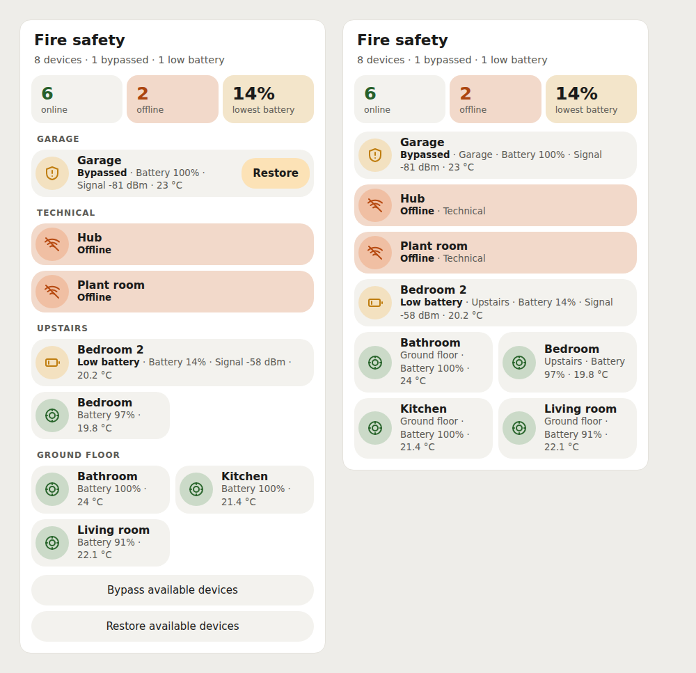

# Aegis Panel Card

Two Home Assistant dashboard cards for the [Aegis for Ajax integration](https://github.com/bvis/aegis-hass): a system overview and a focused device card. They discover Aegis devices from Home Assistant's registries, show alarm and health information, and can expose confirmed bypass controls.



The image uses the production bundle with simulated Home Assistant registries and states. No live Home Assistant instance was used for this project.

## Install

In HACS, open **Custom repositories**, add `https://github.com/mvheimburg/lovelace-ajax` as a **Dashboard** repository, and install **Aegis Panel Card**. Restart Home Assistant or refresh the browser cache if HACS requests it.

HACS normally adds the resource automatically. If it does not, add this JavaScript module in **Settings → Dashboards → Resources**:

```text
/hacsfiles/lovelace-ajax/aegis-panel-card.js
```

For manual installation, copy `dist/aegis-panel-card.js` into Home Assistant's `www/` directory and register its `/local/...` URL as a JavaScript module.

## Cards

The panel card summarizes every discovered Aegis device:

```yaml
type: custom:aegis-panel-card
title: Fire safety
appearance: bubble
group_by: area
show_temperature: true
battery_warning: 20
allow_bypass: false
alarm_entity: alarm_control_panel.home
```

The device card accepts an exact Home Assistant device ID or an exact unique registry name:

```yaml
type: custom:aegis-device-card
device: ajax-workshop
title: Workshop detector
appearance: default
show_temperature: true
battery_warning: 20
allow_bypass: false
```

Both cards have a visual editor. The device picker contains only devices with an `aegis_ajax` registry entity. If registry discovery fails, the editor offers a text field for an exact device ID or unique name.

## Configuration

| Option             | Cards  | Default   | Description                                                                                                                                           |
| ------------------ | ------ | --------- | ----------------------------------------------------------------------------------------------------------------------------------------------------- |
| `type`             | both   | required  | `custom:aegis-panel-card` or `custom:aegis-device-card`.                                                                                              |
| `title`            | both   | card name | Optional heading.                                                                                                                                     |
| `appearance`       | both   | `default` | `default` or `bubble`. Bubble mode uses the dashboard's `--bubble-*` theme variables.                                                                 |
| `show_temperature` | both   | `true`    | Shows discovered temperature readings.                                                                                                                |
| `battery_warning`  | both   | `20`      | Low-battery threshold from `0` through `100`, inclusive.                                                                                              |
| `allow_bypass`     | both   | `false`   | Shows available device and bulk bypass/restore actions. Every action still requires confirmation.                                                     |
| `group_by`         | panel  | `area`    | Groups by `area`, by individual `device`, or uses `none` for a flat list.                                                                             |
| `alarm_entity`     | panel  | unset     | Optional `alarm_control_panel.*` entity. The card opens Home Assistant's native more-info control, including its own PIN and supported-mode handling. |
| `device`           | device | required  | Exact Aegis device ID or exact unique device name. An ambiguous name produces a selection error.                                                      |

The UI follows Home Assistant's English or Norwegian Bokmål language setting.

## Discovery and status

The cards read Home Assistant's entity, device, area, and label registries. Only entities whose registry platform is `aegis_ajax` define membership; similarly named entities from other integrations are excluded. Roles come from recognized Aegis labels, then domain and device class, with integration suffixes used only as a final fallback. Multiple sensors with the same role remain visible, and unrecognized enabled entities appear under **Other** with native more-info access.

Disabled entities do not become readings. The card reports their count and links to Home Assistant's entity settings. Registry access is required; a registry failure shows an error and Retry action instead of an empty, healthy system. The Home Assistant user viewing the dashboard therefore needs permission to read the registries and the selected entities. Service permission is also required to operate bypass switches.

Unavailable or missing readings never count as clear. Connectivity is **online** only with positive connectivity evidence and no unavailable enabled readings; otherwise it is **offline** or **unknown**. Battery sensors retain their reported units, binary low-battery sensors are supported, and the summary uses the lowest known numeric battery reading. Alarm takeover lists every active smoke or heat detector with its area and elapsed time.

## Bypass controls

Bypass controls are hidden until `allow_bypass: true`. Actions are limited to available bypass switches belonging to selected Aegis devices and use Home Assistant's standard `switch.turn_on` and `switch.turn_off` services. Individual and bulk actions always show a confirmation naming the affected scope. Canceling makes no service call, pending requests cannot be duplicated, and service failures remain visible.

Some Aegis configurations bypass only tamper protection; others deactivate more of the device. The confirmation shows the integration's available `deactivation_kinds` and does not describe tamper-only bypass as full exclusion. The card waits for Home Assistant state updates rather than displaying an assumed result.

## Troubleshooting

- **The card is unavailable:** confirm that the resource URL is `/hacsfiles/lovelace-ajax/aegis-panel-card.js`, its type is JavaScript module, then hard-refresh the browser.
- **No devices appear:** install and configure [Aegis for Ajax](https://github.com/bvis/aegis-hass), confirm its entities exist in Home Assistant's entity registry, and use **Retry** after resolving registry permission or connection errors.
- **A device name is ambiguous:** use the exact device ID shown by Home Assistant instead of the shared name.
- **A reading is absent:** confirm the entity is enabled. Disabled entities are deliberately excluded and linked from the card's notice.
- **Connectivity is unknown:** check for an enabled connectivity entity and unavailable device readings. Unknown data is intentionally not shown as healthy.
- **Bypass buttons are absent:** set `allow_bypass: true` and confirm the device has an available Aegis bypass switch. The current Home Assistant user must be allowed to call switch services.
- **The alarm button is absent:** configure an existing `alarm_control_panel.*` entity in `alarm_entity`.

## Development

```sh
npm ci
npx playwright install chromium
npm test
npm run lint
npm run typecheck
npm run build
node scripts/screenshot.cjs
```

Tests and screenshots exercise simulated registry, state, event, and service boundaries in Chromium. They do not claim live Home Assistant verification.

Released under the [MIT License](LICENSE).

### Language (0.1.1)

Cards and visual editors follow Home Assistant's active `hass.language`, falling back to `hass.locale.language`. Bokmål supports `nb`, `nb-NO`, and `no` (including case and underscore variants); existing `nn` support is retained. Other languages fall back to English. Language changes update the UI immediately, including numeric readings and on/off state labels. User names, entity IDs, integration diagnostics and service values remain unchanged.
